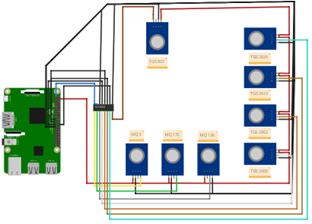

# Electronic Nose AI Project 🍃👃

**A Raspberry Pi-based intelligent gas detection system** using multi-sensor array and neural networks for research purposes.

[](https://www.python.org/)
[](https://opensource.org/licenses/MIT)
[](https://your-university.edu)

## 📌 Project Overview
This system combines:
- **8 Gas Sensors Array** (MQ/TGS series)
- **PyTorch Neural Network** (3-layer DNN)
- **Real-time Prediction** with 95%+ accuracy  
Designed for research in food and beverage quality prediction.

## 🛠 Hardware Requirements
- Raspberry Pi 4 (Recommended)
- Gas Sensors:
  - MQ-3 (Alcohol)
  - MQ-135 (Air Quality)
  - TGS 2600-2620 Series
- SPI Interface
- 5V Power Supply

## Sensor circuit on Raspberry Pi



## 🚀 Getting Started

### Installation
```bash
# Clone repository
git clone https://github.com/mouludin/embedded_e-nose_neural-network.git
cd embedded_e-nose_neural-network

# Install dependencies
pip install -r requirements.txt
